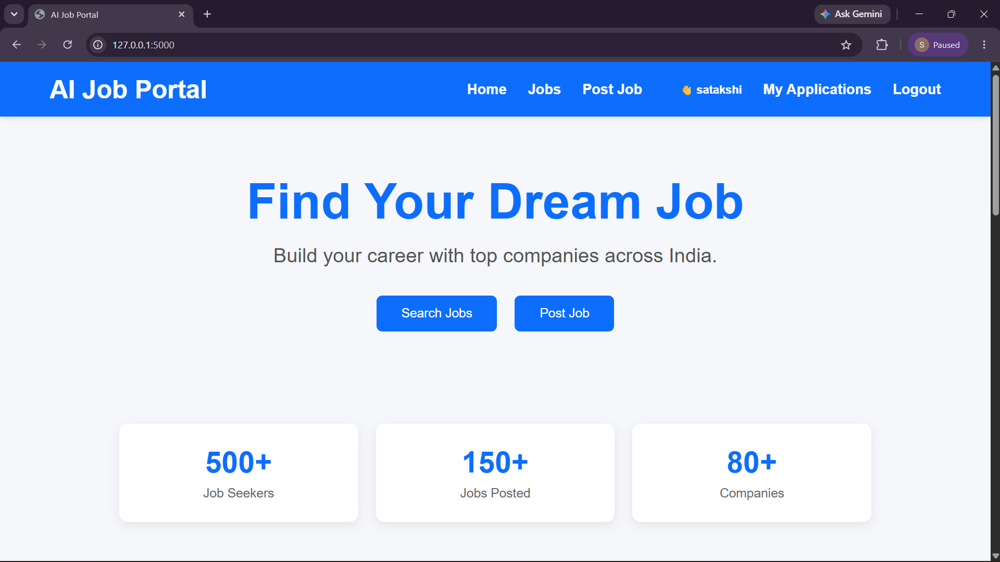
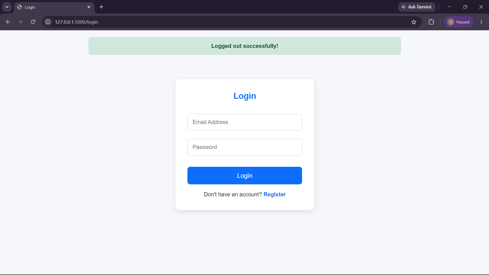
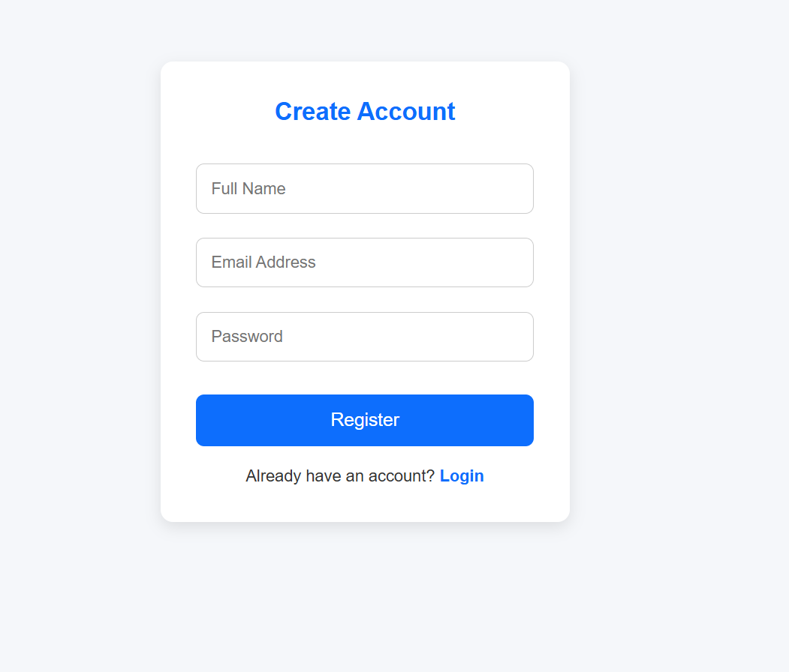
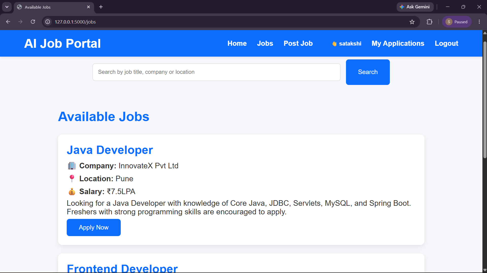
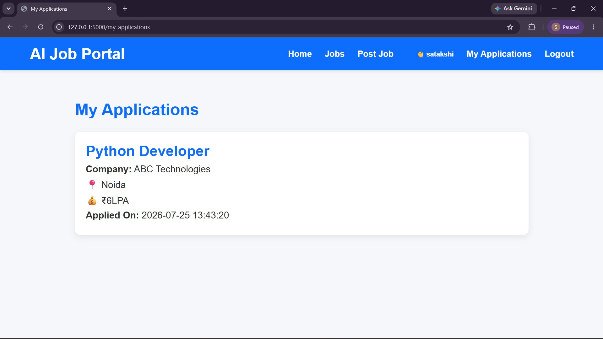

# AI Job Portal

A full-stack job portal built with Flask and MySQL where users can create an account, explore available jobs, post new opportunities, and apply for jobs through a simple and responsive interface.

This project was developed to strengthen my understanding of Flask, database integration, authentication, and CRUD operations while building a real-world web application.

## Features

- User registration and login with password hashing
- Session-based authentication
- Post new job openings
- Browse all available jobs
- Search jobs by title, company, or location
- Apply for jobs
- Prevent duplicate job applications
- View previously applied jobs
- Responsive interface built using HTML and CSS

## Tech Stack

- Python
- Flask
- MySQL
- HTML
- CSS
- Jinja2
- Werkzeug Security

## Project Preview

### Home Page


### Login


### Register


### Available Jobs


### My Applications


## Getting Started

Clone the repository:

```bash
git clone https://github.com/SatakshiChauhan13/AI-Job-Portal.git
```

Install the required packages:

```bash
pip install -r requirements.txt
```

Create a MySQL database named `job_portal`, update the database configuration in `config.py`, and run:

```bash
python app.py
```

## What I Learned

While building this project, I learned how to:

- Build a complete Flask application
- Connect Flask with MySQL
- Manage user authentication securely
- Work with sessions and flash messages
- Perform CRUD operations
- Organize a full-stack web project

## Future Improvements

- Resume upload support
- Company profiles
- Admin dashboard
- Email notifications
- Job categories and filters

## About Me

I'm **Satakshi Chauhan**, a BCA student passionate about Python, web development, and building practical projects that solve real problems.

GitHub: https://github.com/SatakshiChauhan13